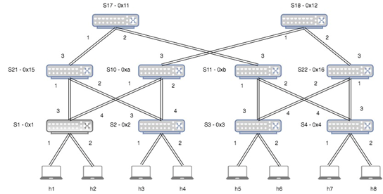
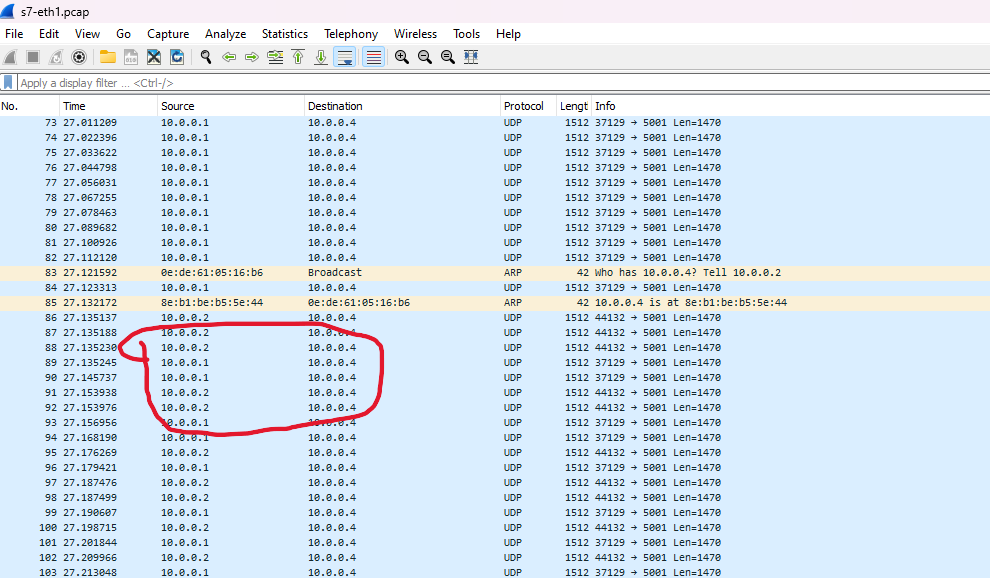

# Reproducing Dynamic Load Balancing in SDN-Based Data Center Networks

## Introduction

This repository provides a step-by-step guide to reproduce a paper titled "Dynamic Load Balancing in SDN-Based Data Center Networks". The implementation leverages Mininet for topology simulation and the Floodlight SDN controller for traffic management. The primary objective is to optimize traffic flow across a Fat-Tree topology, a widely-used hierarchical structure in data centers. By dynamically adapting to real-time network utilization, this solution effectively prevents congestion and improves bandwidth usage. Researchers and developers can use this repository to replicate the behavior, validate results, and analyze network performance.

## Goals

This project aims to reproduce the following:

1. A dynamic load balancing system for traffic optimization in SDN-based data center networks.
2. Efficient bandwidth utilization in a Fat-Tree topology by redistributing traffic based on real-time link utilization.
3. A scalable and adaptive SDN solution using the Floodlight controller and RESTful APIs for performance monitoring and management.

## Key Features

- **Fat-Tree Topology**: A scalable and hierarchical topology commonly used in data centers, implemented in Mininet.
- **Floodlight Controller**: Manages traffic flows, retrieves network statistics, and enforces dynamic routing policies.
- **Dynamic Load Balancing**: Continuously monitors link utilization and recomputes optimal paths every 10 seconds.
- **RESTful APIs**: Utilizes Floodlight APIs to fetch topology, bandwidth, and flow statistics and apply updated flow rules.
- **Traffic Engineering**: Ensures efficient bandwidth utilization by directing traffic based on real-time link statistics.

---

## Topology

Below is the Fat-Tree topology used for this project:

()

## Algorithm

### Algorithm 1: Heuristic for Traffic Load Balancing

This algorithm dynamically minimizes the maximum link utilization for all traffic flows in the network by selecting optimal paths for each flow based on real-time link utilization data.

#### **Steps**
1. For all possible flows \( f \) in the Traffic Matrix \( T \):
   - List flows in ascending order based on priority.
   - Identify all possible paths from \( f_{\text{src}} \) to \( f_{\text{dst}} \).

2. For each path \( p \) obtained from Dijkstra's algorithm:
   - Calculate the maximum link utilization of \( p \).

3. Select the path \( p_{\text{selected}} \) with the minimum maximum link utilization.

4. Assign the flow \( f \) to \( p_{\text{selected}} \).

5. Update the flow switch table for all links in \( p_{\text{selected}} \).

6. Repeat for all flows.

Link cost is calculated as follows
    - **Link cost = f(current utilization, flow priority, and bandwidth).**

This heuristic ensures an even distribution of traffic across available paths, preventing link congestion and improving overall network performance.

---

## Steps to Implement and Verify Load Balancing

Execute steps 1, 2, 3, 5 before load balancing and collect results by following the verification steps listed below. Then, execute steps 1, 2, 3, 4, and 5 and collect results by following the same verification steps. This will indicate the change in bandwidth and distribution of traffic after the load balancing algorithm is applied.

### Steps:

1. **Docker Compose up to start the conatiners.  Make sure docker and docker-compose is installed**  
    ```bash
    docker-compose up
    ```
    Note: [Steps to install docker and docker-compose](https://shaonmajumder.medium.com/how-to-install-docker-and-docker-compose-on-ubuntu-lts-22-04-6cdae142b9b5)

2. **Start Mininet in Terminal 1**  
    ```bash
    docker exec -it mininet bash
    mn --custom /scripts/mininet-topology.py --topo customtopo --controller=remote,ip="floodlight"
    ```

3. **Collect TCP dump on Ethernet 1 of Switch 7**  
    Open a new terminal and run:  
    ```bash
    docker exec -it mininet bash
    tcpdump -i s7-eth2 -w s7-eth1.pcap &
    ```

4. **Collect TCP dump on Ethernet 2 of Switch 7**  
    Open another terminal and run:  
    ```bash
    tcpdump -i s7-eth1 -w s7-eth2.pcap &
    ```

5. **Start the Load Balancing Script**  
    Login to the Floodlight container and run:  
    ```bash
    docker exec -it floodlight bash
    python3 /scripts/loadbalancer.py
    ```

6. **Verify Traffic in Terminal 1**  
    ```bash
    mininet> h4 iperf -s &
    mininet> h1 iperf -c h4 -u -t 30 > h1_perf_output.txt &
    mininet> h2 iperf -c h4 -u -t 30 > h2_perf_output.txt &
    ```

## Utility Scripts
1. The script is designed to manage and monitor a software-defined network by using Floodlight's REST API. It fetches switch details, topology links, static flows, and bandwidth statistics, presenting them in a readable format for analysis  [dijkstra-input-vm.py](https://github.com/ramasamy-t/SDN-DCN-Load-Balancing/blob/main/dijkstra-input-vm.py)

2. This Python script is designed to interact with the Floodlight SDN (Software Defined Networking) controller. It enables pushing and retrieving static flow entries via Floodlight's REST API. [push-flows.py](https://github.com/ramasamy-t/SDN-DCN-Load-Balancing/blob/main/push-flows.py)

3. This Python script interacts with a Floodlight SDN (Software Defined Networking) controller to monitor the network topology, analyze link utilization, compute optimal paths for traffic flows, and dynamically push flow rules to switches. [loadbalancer.py](https://github.com/ramasamy-t/SDN-DCN-Load-Balancing/blob/main/loadbalancer.py)

## Results and Verification

#### **Before Load Balancing**
The following images demonstrate the traffic distribution on interfaces before applying the load balancing algorithm:

1. **Screenshot 1**:  
   

2. **Screenshot 2**:  
   

3. **Screenshot 3**:  
   

4. **Screenshot 4**:  
   

#### **After Load Balancing**
The following images demonstrate the traffic distribution on interfaces after applying the load balancing algorithm:

1. **Screenshot 1**:  
   

2. **Screenshot 2**:  
   

3. **Screenshot 3**:  
   

4. **Screenshot 4**:  
   

5. **Screenshot 5**:  
   

#### **Inference from Screenshots**

1. **Traffic Distribution in Wireshark**  
    Import the `s7-eth1.pcap` and `s7-eth2.pcap` files into Wireshark. This will show the traffic distribution among the two interfaces of Switch 7.

2. **Change in Bandwidth**  
    Open the files `h1_perf_output.txt` and `h2_perf_output.txt` to see the changes in bandwidth before and after applying the load balancing algorithm.

---

## Advantages of Implementing this Solution

1. Enhanced throughput and reduced latency.
2. Optimized bandwidth utilization.
3. Dynamic adaptability to traffic conditions.
4. Improved user experience with minimized packet loss.

## Limitations

1. Algorithm focuses only on link utilization; node utilization is not considered.
2. Scalability is limited to the fat-tree topology tested.
3. Limited Adaptability to Real-Time Network Changes.

## Conclusion

This repository reproduces the results from the paper *Dynamic Load Balancing in SDN-Based Data Center Networks*. Using the implemented algorithm and tools, users can validate the effectiveness of dynamic traffic allocation in minimizing maximum link utilization and improving overall network performance. This project showcases the scalability and adaptability of SDN-based solutions for modern data center networks.

## Reference

Here is the reference of the paper reproduced: 
[Dynamic load balancing in SDN-based data center networks](https://ieeexplore.ieee.org/document/8117206). Zakia, U., & Ben Yedder, H. (2017). Dynamic load balancing in SDN-based data center networks. Proceedings of the IEEE International Conference on Computer Science and Networking, 1–7.

[Link to Youtube Video ](https://youtu.be/YsU-R0dI15o)

This is done for academic purpose as a part of Purdue CS536 Course Project (Fall-2024).
